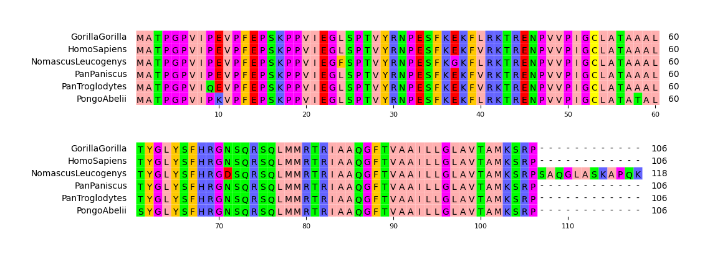
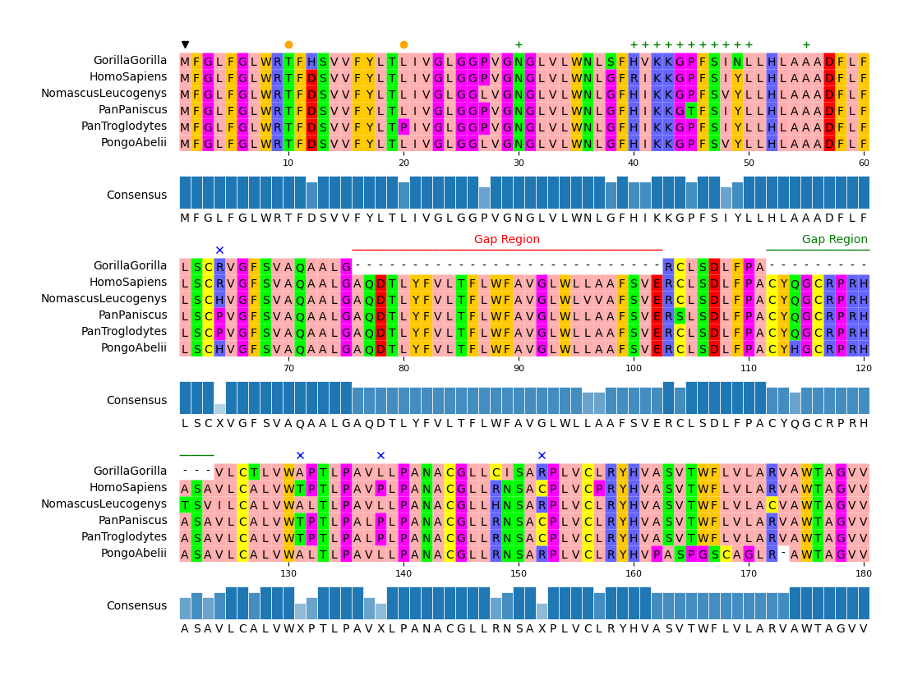

# pyMSAviz

  

## Overview

pyMSAviz is a MSA(Multiple Sequence Alignment) visualization python package for sequence analysis implemented based on matplotlib.
This package is developed for the purpose of easily and beautifully plotting MSA in Python.
It also implements the functionality to add markers, text annotations, highlights to specific positions and ranges in MSA.
pyMSAviz was developed inspired by [Jalview](https://www.jalview.org/) and [ggmsa](https://github.com/YuLab-SMU/ggmsa).

<figure markdown>
  
  <figcaption>Fig.1 Simple visualization result</figcaption>
</figure>

<figure markdown>
  
  <figcaption>Fig.2 Customized visualization result</figcaption>
</figure>

## Installation

`Python 3.9 or later` is required for installation.

**Install PyPI package:**

    pip install pymsaviz

**Install bioconda package:**

    conda install -c conda-forge -c bioconda pymsaviz
